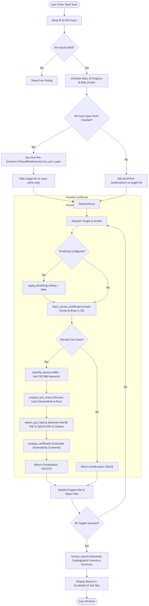

# PQC Network Scanner 2.0 - Code Analysis & Workflow

All custom logic of the **PQC Network Scanner 2.0** application is implemented in a single main Python module:

*   **Main File:** [PQC_Network_Scannerv2.py](file:///c:/Users/chauh/Downloads/PQC%20Scanner%20Github/PQC_Network_Scannerv2.py)

During extraction from the executable, only standard Python system libraries and the third-party `cryptography` package were bundled in the archive. There are no other custom modules or scanning-related files.

---

## 🔍 Scanning Logic Implementation

Here is a breakdown of the specific classes and functions in [PQC_Network_Scannerv2.py](file:///c:/Users/chauh/Downloads/PQC%20Scanner%20Github/PQC_Network_Scannerv2.py) where the core scanning, throttling, and PQC analysis are implemented:

### 1. Network Pacing & Evasion
*   **`RateLimiter`** (Lines 158–201): A thread-safe rate pacing utility that enforces maximum requests per second and adds timing jitter.
*   **`apply_throttling`** (Lines 570–601): Enforces delays between connection attempts based on the selected mode (Normal, Slow, Stealth, Random, Adaptive). It supports adaptive slowing if error rates exceed 20%.

### 2. Network Scanning & Certificate Fetching
*   **`is_port_open`** (Lines 603–615): A rapid TCP connect-only port scanner used to pre-filter active ports.
*   **`fetch_server_certificate`** (Lines 317–394): Initiates a raw TCP connection wrapped in an SSL socket (without hostname verification) to retrieve the negotiated cipher, TLS protocol version, and the full DER-encoded certificate chain.
*   **`fetch_cert_chain_openssl`** (Lines 270–315): A fallback mechanism that spawns `openssl s_client` via subprocess if the Python standard `ssl` library fails to fetch intermediate/root certificates in the chain.

### 3. PQC & Cryptographic Analysis
*   **`detect_pqc_hybrid_features`** (Lines 389–494): The core logic for detecting quantum-resistant features. It matches algorithms, public keys, and certificate extensions against a list of canonical Post-Quantum Cryptography (PQC) Object Identifiers (OIDs) and keywords:
    *   **PQC Signatures:** Dilithium (ML-DSA), Falcon, SPHINCS+ OIDs (Lines 196–222).
    *   **PQC Key Encapsulation (KEMs):** Kyber (ML-KEM) and Hybrid KEMs (e.g., X25519-Kyber768) OIDs (Lines 224–249).
    *   **PQC Extensions:** OIDs indicating PQC algorithm identifier or composite extensions (Lines 251–256).
    *   **Cipher Suites:** Patterns such as `x25519_kyber` or `hybrid` in the TLS handshake cipher suite.
*   **`analyze_cert_chain`** (Lines 496–567): Iterates through each certificate in the chain (Leaf, Intermediate, Root), analyzes its signature/key type, and flags quantum vulnerabilities (RSA/ECC keys) or PQC features.
*   **`analyze_certificate`** (Lines 717–903): Orchestrates the throttling, certificate fetching, device identification, certificate chain analysis, and hazard scoring (Low, Medium, High) based on key sizes and PQC readiness.

### 4. Device Profiling
*   **`identify_device`** (Lines 617–705): Performs a reverse DNS lookup and parses the certificate Common Name (CN) or Subject Alternative Name (SAN) for keywords (e.g., `firewall`, `vpn`, `loadbalancer`) to categorize the target device.

---

## 🗺️ Workflow Diagram

The flowchart below visualizes the execution flow of the application from the user triggering a scan in the GUI to the generation of the final cryptographic exposure report.

